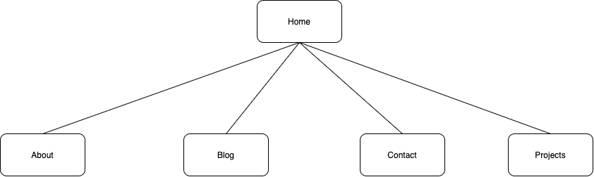
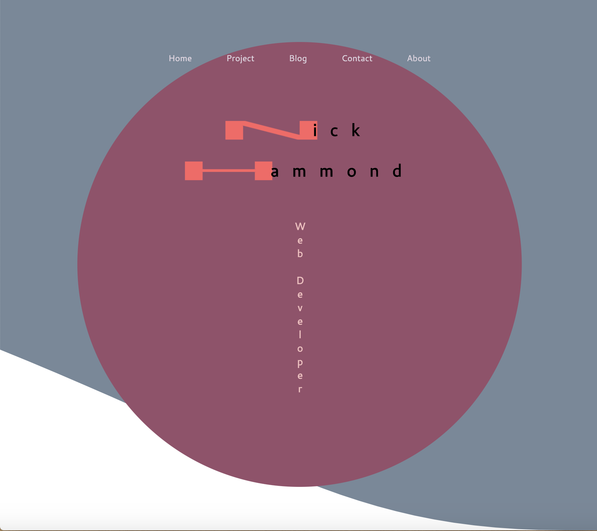
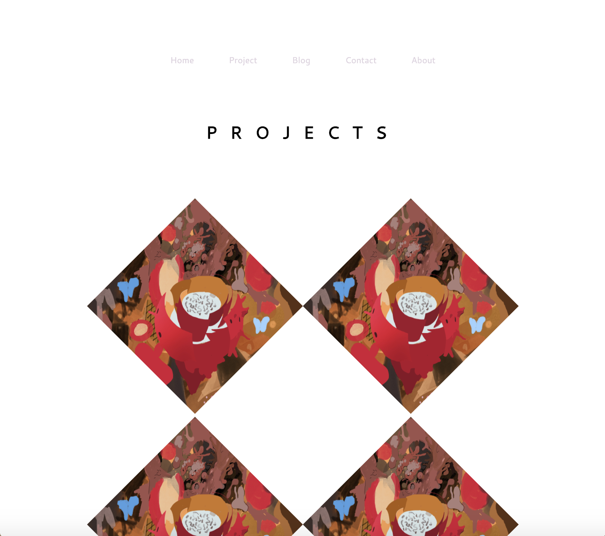
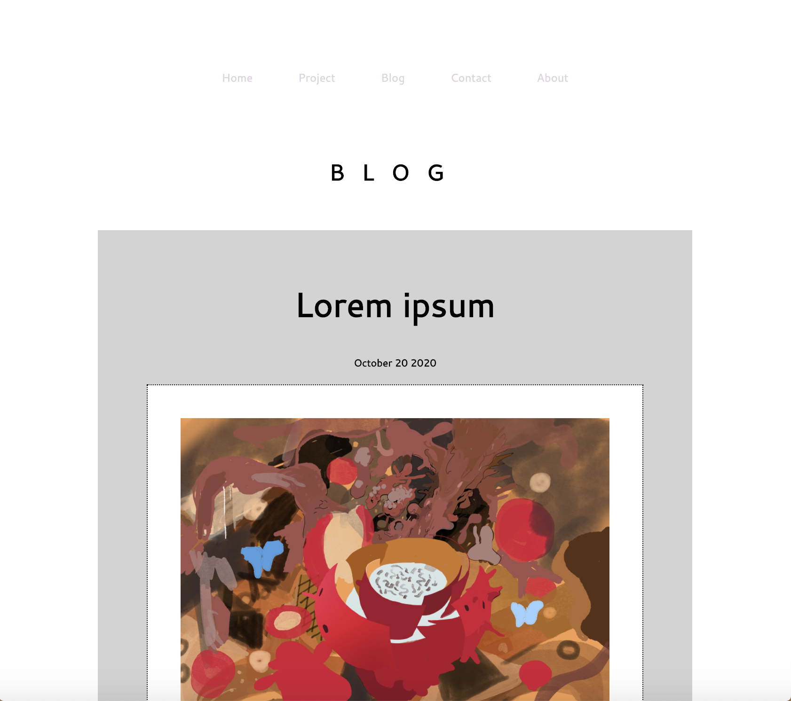
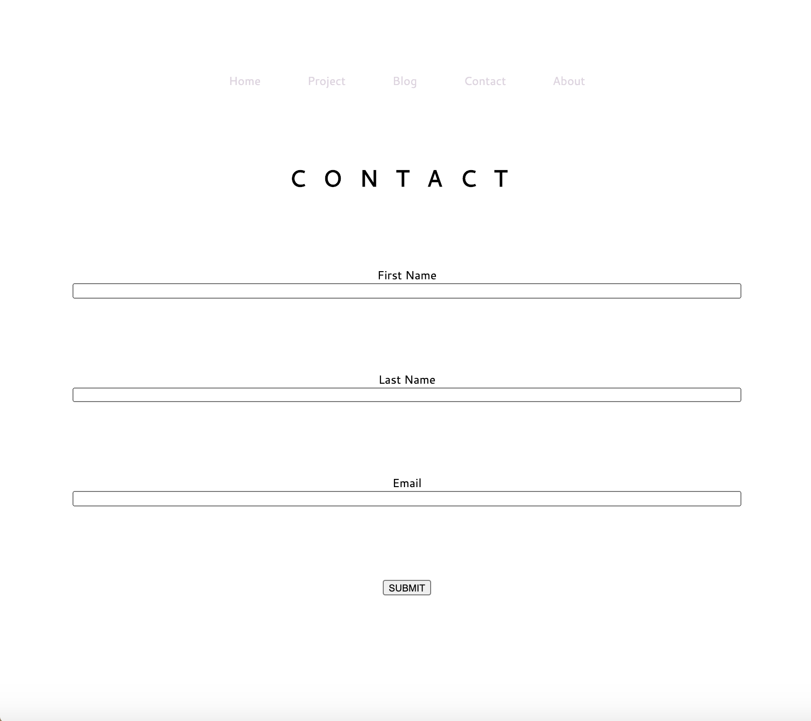
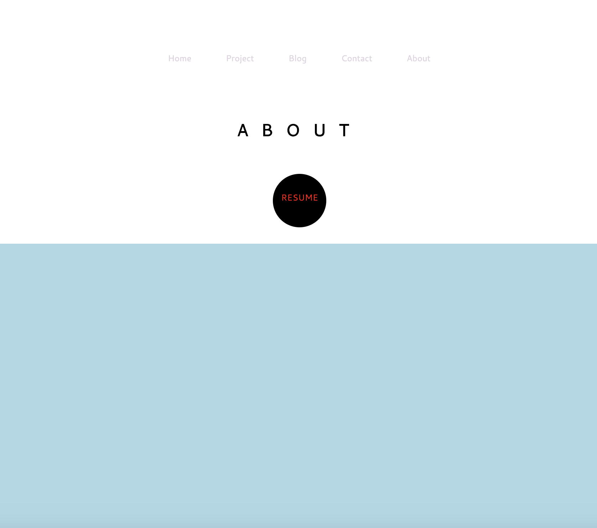
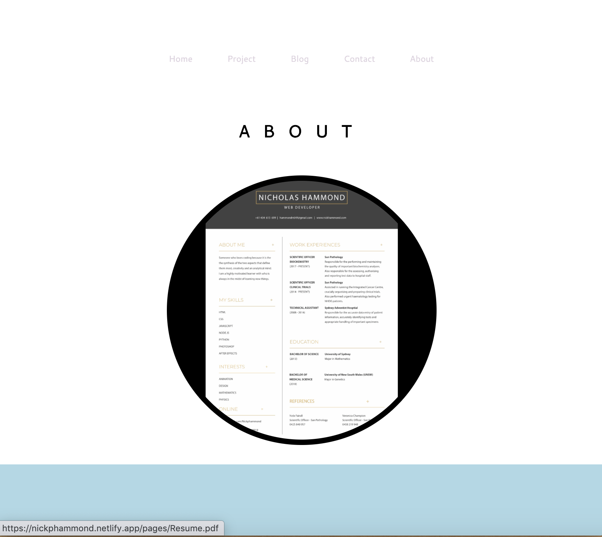

# PORTFOLIO WEBSITE

The website is published at https://nickphammond.netlify.app/index.html

The code for the website can be found at https://github.com/Nickphammond/T1A2-Portfolio-Website
 
 
 

## Purpose

The purpose of this website is to give the owner a way of letting prospective clients and employers find out about their work and background. There is a page dedicated to displaying the owner's past work, a page dedicated to giving information about the owner specifically and a page by which the owner my be contacted.
 
 
 

## Target Audience

As per the previous paragraph the primary audience is prospective clients and employers.
 
 
 

## Functionality

The site uses hyperlinks to direct to other pages. In particular a navigation bar is available on all pages to from which a user may navigate to any other part of the website. 
The site also includes a form by which a user may submit their details and contact the owner.
 
 
 
 
 

## Sitemap
 

 
 
 
 
 

## Screenshots
 
 

### Home page

 

### Projects

 

### Blog

 

### Contact

 

### About

 
 
 
 
 

## Tech stack
 

HTML 
 CSS 
 JAVASCRIPT 
 NETIFLY